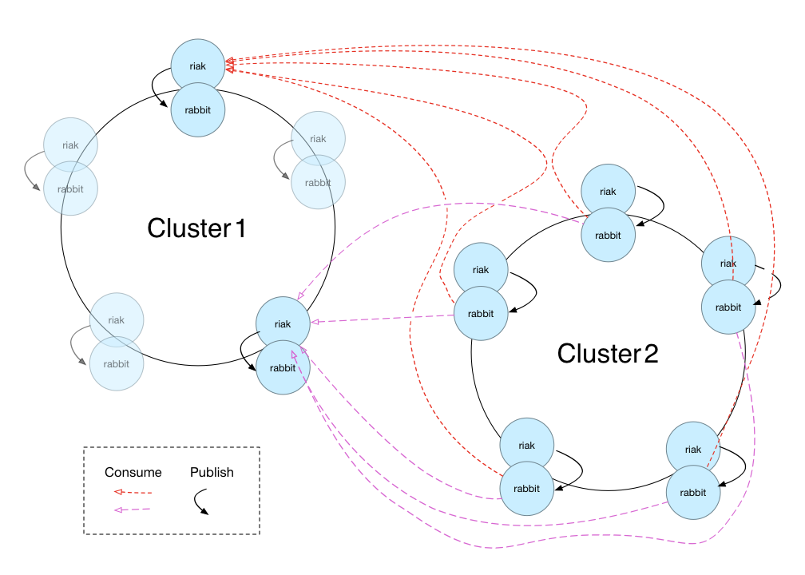
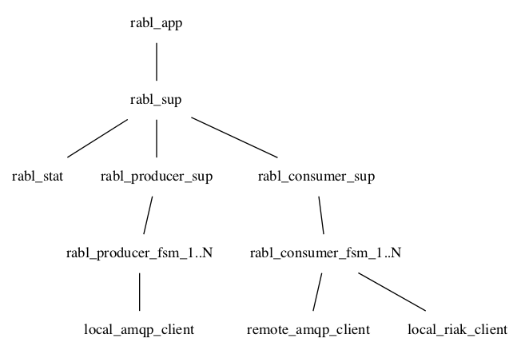
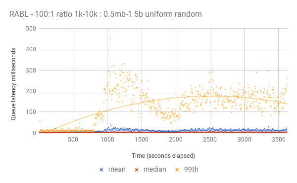

# Introducing Rabl

This post is about rabl, a [RabbitMQ](https://www.rabbitmq.com/)
backed, open source drop in replacement for Basho's "realtime"
multi-datacentre replication product.

NOTE: I started work on this post before
[bet365](https://www.bet365.com) made the community aware of their
[plan to open source all Basho's code](http://lists.basho.com/pipermail/riak-users_lists.basho.com/2017-August/019500.html)
on the
[riak users mailing list](http://lists.basho.com/mailman/listinfo/riak-users_lists.basho.com). With
the impending open sourcing of all Basho's proprietary code maybe this
post and rabl are redundant, but maybe not. Read on for details.

## MDC - Fullsync and Realtime

Basho's [Riak](https://github.com/basho/riak) database is Apache 2
Licensed open source software, but their multi-datacentre replication
(hereafter MDC) add on, dubbed RiakEE, was a paid for, proprietary,
closed source product. It provided two key inter-acting features,
"Realtime Replication" and "Fullsync Replication". Realtime is a
process that makes a best endeavour to send any changed object to some
configured remote cluster(s) as soon as the write is committed at the
local cluster. Fullsync, as the name suggests, runs at some regular
interval and ensures that any pair of clusters are up-to-date with
each other and contain all the same data. A cluster that is
replicating objects is called the _source_ cluster, and one that is
receiving replicated objects is called the _sink_ cluster.

### Why Open Source MDC?

[Basho recently declared bankruptcy](https://www.theregister.co.uk/2017/07/31/end_of_the_road_for_basho_as_court_puts_biz_into_receivership/)
and went into receivership.

There is a large and active community of industrial Riak users, and
without Basho to develop and maintain Riak, an open source alternative
to replication appeared to be a need if the community was to benefit
from continued development effort on a common code base.

### Why is Rabl Realtime Only?

It is assumed that Rabl will be used in conjunction with a background
fullsync mechanism.  This might be:

* One of the generation of fullsync mechanisms available previously in
  Riak MDC, and now potentially to be open-sourced by bet365.
* Alternative current mechanisms that exploit other existing
  open-source Riak features (for example the NHS had issues with Riak
  fullsync and replaced it with their own in-house solution called
  _DeltaTouch_ which relies on secondary indexes tracking last
  modified dates and versions of objects.)
* New proposals to more efficiently exchange the whole database state
  and/or the state of recent changes (some hints
  [here](https://github.com/martinsumner/leveled/blob/master/docs/ANTI_ENTROPY.md)
  of the work in progress in this area)

### Why RabbitMQ?

Working on the principal of "do the easiest possible thing that could
work", a first design for realtime replication could be a Riak
[post-commit hook](https://www.tiot.jp/riak-docs/riak/kv/2.2.3/developing/usage/commit-hooks/#post-commit-hooks)
and a queue. When an object is written, the post-commit hook publishes
the changed object to the queue, and a subscriber to the queue on a
remote cluster reads from the queue and writes the changed object.

There exists a perfectly capable Erlang queue implementation in
[RabbitMQ](https://www.rabbitmq.com/). RabbitMQ has a lot going for
it:

* NHS-Digital already use RabbitMQ extensively
* RabbitMQ has a long history of successful deployment (10 years!)
* RabbitMQ is Open Source
* There is an Active Community

And beyond that, why write a queue when a good queue exists?  RabbitMQ
means less rabl code. RabbitMQ also gives the deployer a lot of
flexibility and benefits:

* Want more reliability? Rabbit supports clustering, ACKs, delivery
  reports, dead letter queues, blocked connection handling etc.
* Want more security? Rabbit supports SSL,
  authentication/authorisation/accounting.
* Want more monitoring? Rabbit has management and monitoring plug-ins
  including metrics for queue size and message rates.
* Want to handle special network conditions? Rabbit has shovel,
  support for NAT, network tuning options etc.
* Want external systems to subscribe to a stream of Riak object
  writes? Have those systems subscribe to the rabl queue(s).

That last point is something new, and potentially valuable, for Riak.

We were able to run a proof of concept realtime replication
implementation after a few hours work, and see that yes, RabbitMQ
could do the job.

### How Rabl works

As described above, the easiest thing that could work is a post-commit
hook, a queue, and a subscriber, and that is essentially all there is
to rabl.

The queue is RabbitMQ. In testing what has worked best for us has been
a RabbitMQ node per Riak node. We tested with two RabbitMQ clusters
using shovel for the multi-datacentre replication and found the
latency variability to be extremely high. With a RabbitMQ node per
Riak node we've seen more predictable performance.

Although not my best diagram, what I attempt to show is that each Riak
node publishes changes to its local RabbitMQ node and consumes from
every remote RabbitMQ node. Though the topology is configurable and up
to you.

Rabl is an OTP application. At present it is designed to be started
inside a Riak node that is running unmodified Basho code (Enterprise
or Open Source) though in future it could be included with Riak. Each
Riak node in the cluster runs rabl. Rabl is not a distributed or
clustered application.

The rabl app is made up of two sides, producers and consumers. A
configurable number of each is declared in the `advanced.config` for
riak, in the `rabl` tuple.

Both consumers and producers are declared in a two-tuple of `{Type,
[{Count, AMQPUri}]}`. Using amqp uris means there is a lot of power in
the
configuration. [Security, network parameters, and other options](https://www.rabbitmq.com/uri-query-parameters.html)
can be configured via amqp uris.

The configuration:

        {rabl, [
            {consumers, [{3, "amqp://remote1"}, {3, "amqp://remote2"}]},
            {producers, [{1, "amqp://localhost"}]}
            ]}.

means "start 3 consumers of the queue on remote1 and 3 from remote2"
and 1 producer to the local RabbitMQ node.  When rabl starts up the
consumer supervisor will start 6 consumer processes, 3 to remote1 and
3 to remote2. These processes will each encapsulate a connection to
the remote RabbitMQ node and a local Riak Client. Likewise the
producer supervisor will start a single producer that wraps a local
RabbitMQ connection.

When a remote Riak node publishes a changed Riak object to its queue
via the `rabl_hook` post-commit hook, one of the consumers will be
notified by RabbitMQ and store the object locally. Setting the correct
PUT option parameters on the PUT at the consumer ensures that the
post-commit hook doesn't fire again and short-circuits an eternal loop
of replication. Specifically rabl adds `asis` and `disable_hooks` to
the list of PUT options.

`asis` tells Riak NOT to increment the version vector on this
PUT. `asis` is an option from back when Riak moved from
[client side version vectors to vnode version vectors](http://basho.com/posts/technical/vector-clocks-revisited/)
and mixed operation was possible. It's essential not to increment the
version vector on a replicated PUT otherwise false concurrency could
be introduced.

The `disable_hooks` option does as it says and tells Riak not to run
post-commit hooks on this PUT, which ensures that the object isn't
then replicated back to the source cluster, resulting in an infinite
loop of replication.

The combination of `disable_hooks` and `asis` has all `N` replicas on
the sink cluster treat the PUT as the local non-coordinating vnodes do
for a local write, and simply performing a syntactic merge before
storing the value.

Rabl currently only supports a simple 2 cluster topology. In the rabl
configuration a local `clustername` is declared, and that is the queue
to which Riak publishes changes. A `source_cluster` is also declared,
and this is the queue to which rabl subscribes. Extending rabl for
multiple clusters and queues is as simple as changing the format of
the configuration to include a queue name.

### Trying Rabl

Rather than reproduce the instructions in the README, I direct you to
the
[How Do I Use It](https://github.com/nhs-riak/rabl#how-do-i-use-it)
section.

### Stats and Results

Rabl use [folsom](https://github.com/boundary/folsom) to generate some
basic metrics. Rabl uses local time at each cluster to calculate
latency. I know! I know! distributed systems and time! If the
clusters' clocks aren't reasonably well synchronised your latency
histograms will be meaningless.

So far the testing has been fairly simple and based solely around the
NHS-Digital use case. The chart below shows latency for
one-way-replication from cluster ONE to cluster TWO. The NHS use case
has fairly large objects. The load generator puts objects into Riak on
cluster ONE. There are small objects, sized between 1k and 100k with a
random distribution, and large objects, sized between 500k and 1.5MB
with a random distribution. The ratio of small objects to large
objects is 100:1.

The environment is two 4 node Riak clusters on r3x.larges, one in
us-west-1 the other in us-west-2. Though not in any way conclusive,
this gives and impression of the latency for these larger objects.

### Future Work

Well that really is the question now, isn't it? Originally this
section was about further testing and bench-marking and tuning,
polishing and production readying code, through to deployment at the
NHS. Now, with bet365 open sourcing MDC replication, I guess the next
obvious step would be a side-by-side comparison. That list of RabbitMQ
advantages above is still relevant when the Basho code is open
source. Watch this space.

## Conclusion

The simplest possible thing that could work _worked_ well enough in
testing that we made rabl. RabbitMQ is perfectly capable for this kind
of use case. Hooking an OTP application into a Riak node is a simple
way to drop realtime replication into an existing set up. Though the
future of rabl is now far from clear, it's open source and under
active development, and you're welcome to give the tyres a kick
[https://github.com/nhs-riak/rabl](https://github.com/nhs-riak/rabl).
